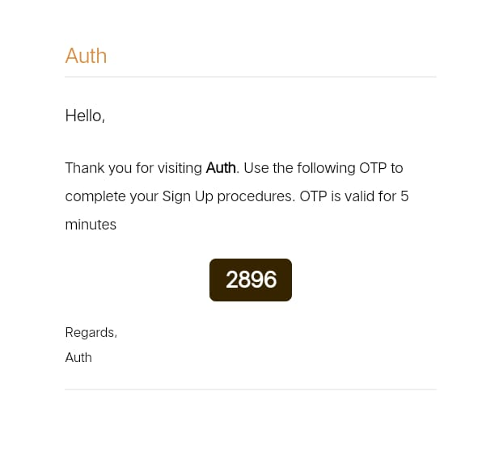

# CFT-ASG

1. Createed user authentication with email and password.
2. Appled crud operation on user schema with mongodb connectivity.
3. Implemented Tokens and middleware functions for authcheck.

Check API documentation [here](https://documenter.getpostman.com/view/11440375/2s83YVHRha)

Email Authentication is done using OTP

